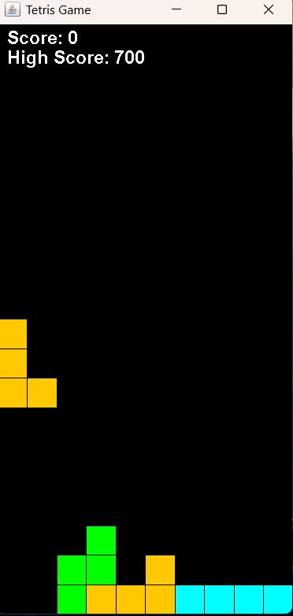
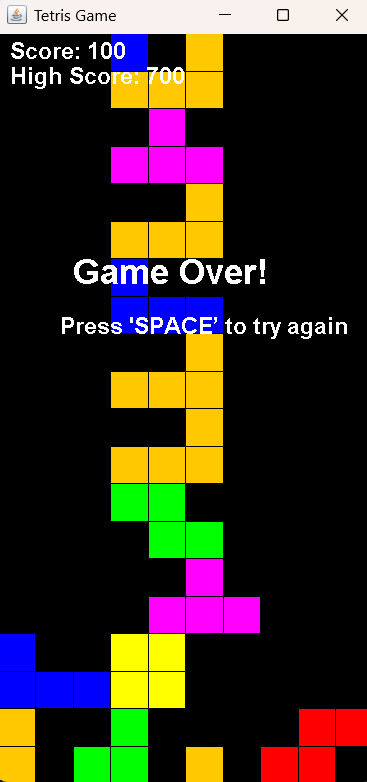

# Tetris Game

A classic Tetris game built in **Java** using **Object-Oriented Programming** principles and the **Swing** GUI toolkit.

## Screenshots





## Overview

This project recreates the classic falling-block puzzle game. Pieces (tetrominoes) spawn at the top of a 10x20 grid and fall automatically, and the player must move, rotate, and stack them to clear complete horizontal lines. The game tracks the current score and persists the high score across sessions using file I/O.

## Features

- Seven classic tetromino shapes (I, O, T, S, Z, J, L), each with its own color
- Keyboard-based movement and rotation
- Automatic piece falling with a timer-based game loop
- Line-clear detection and scoring (100 points per cleared line)
- Persistent high score, saved to and loaded from `highscore.txt`
- Game-over detection with a restart option

## Controls

| Key | Action |
|---|---|
| Left Arrow | Move piece left |
| Right Arrow | Move piece right |
| Down Arrow | Move piece down |
| Up Arrow | Rotate piece |
| Space | Restart after game over |

## Project Structure

```
tetrisgame/
├── Tetrisgame.java   # Entry point, sets up the game window (JFrame)
├── Board.java         # Core game logic, rendering, input handling, scoring
└── Tetromino.java     # Piece definitions, movement, and rotation logic
```

### Class Breakdown

- **Tetrisgame** — Contains the `main` method. Initializes the Swing window and adds the game board to it.
- **Board** — Extends `JPanel` and implements `ActionListener`. Manages the grid, game timer, keyboard input, piece placement, line clearing, rendering, and score/high score persistence.
- **Tetromino** — Represents a single falling piece. Defines the seven standard shapes and their colors, and handles movement, collision detection, and rotation (using matrix transposition).

## How It Works

- The grid is represented as a 2D array of `Color` objects (`Color[][] grid`), where `null` means an empty cell.
- A `Timer` triggers piece movement at fixed intervals, moving the current piece down or locking it in place if it can no longer move.
- When a row is completely filled, it is cleared and all rows above shift down by one, and the score increases.
- The high score is saved to `highscore.txt` when the game ends and reloaded automatically the next time the game starts.

## Requirements

- Java Development Kit (JDK) 8 or higher

## Running the Game

Compile and run from the project directory:

```bash
javac tetrisgame/*.java
java tetrisgame.Tetrisgame
```

## Possible Improvements

- Add a "next piece" preview
- Add soft drop / hard drop functionality
- Increase falling speed as the score increases (level system)
- Add sound effects and a pause menu
